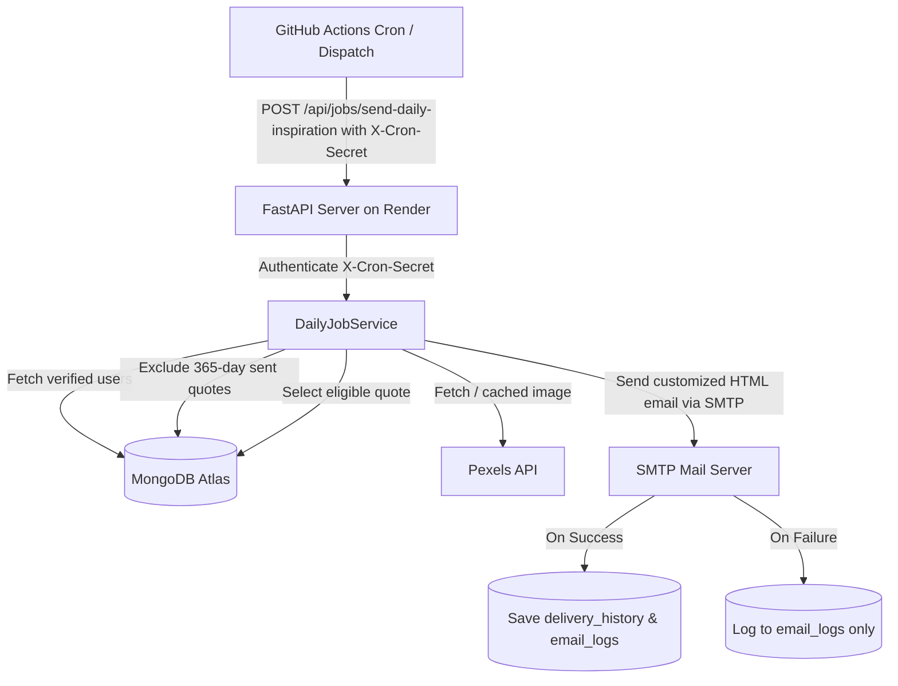

# Daily Inspiration 🌟

A production-ready Python web application that sends personalized daily inspirational emails to subscribers. Powered by **FastAPI**, **MongoDB Atlas**, a **Local Curated Quote Dataset**, and automated via **GitHub Actions**.

---

## 🚀 Key Features

- **Local Quote Dataset**: Complete independence from flaky external Quote APIs. 100% reliable local dataset stored in `data/quotes.json` and synchronized with MongoDB.
- **SHA-256 Deduplication & Intelligent Categorization**: Zero quote duplicates with keyword-based rule fallback for 9 supported categories:
  - `Success`, `Career`, `Study`, `Personal Growth`, `Leadership`, `Discipline`, `Entrepreneurship`, `Failure & Resilience`, `Happiness`.
- **365-Day Uniqueness Guarantee**: Subscribers never receive the same quote twice within a 365-day cycle.
- **GitHub Actions Daily Trigger**: Stateless dispatch model perfectly suited for cloud platforms (e.g. Render). GitHub Actions invokes the protected endpoint `POST /api/jobs/send-daily-inspiration` once a day.
- **Secure Endpoint Protection**: All background jobs are protected by `X-Cron-Secret` header authentication.
- **Pexels Visual Storytelling**: Automatic contextual image retrieval and caching per quote.
- **Interactive Email & Feedback System**: One-click feedback links ("Loved it", "Helpful", "Not for me") directly from inbox.
- **OTP Verification & Preferences**: Secure 6-digit email verification and preference management.

---

## 🛠️ Architecture & Flow



---

## 📁 Project Structure

```
Fast_pro/
├── .github/
│   └── workflows/
│       └── daily-inspiration.yml   # Scheduled daily GitHub Actions workflow
├── app/
│   ├── main.py                     # FastAPI application entry point & routes
│   └── __init__.py
├── core/
│   ├── config.py                   # Pydantic Settings & environment loader
│   ├── database.py                 # MongoDB Atlas connection & index manager
│   └── __init__.py
├── data/
│   └── quotes.json                 # Ready-made curated quotes dataset
├── models/
│   ├── user.py                     # User & preference schemas
│   ├── quote.py                    # Quote data model
│   ├── otp.py                      # OTP record schema
│   ├── delivery.py                 # 365-day delivery tracking schema
│   ├── feedback.py                 # User feedback schema
│   └── __init__.py
├── routers/
│   ├── subscription.py             # OTP request, verify, unsubscribe, Google Auth
│   ├── preferences.py              # User category customization
│   ├── feedback.py                 # Feedback submission endpoints
│   ├── jobs.py                     # Protected cron job endpoints
│   └── __init__.py
├── scripts/
│   └── import_quotes.py            # CLI quote dataset import utility
├── services/
│   ├── quote_service.py            # Dataset import, categorization, 365-day selection
│   ├── scheduler_service.py        # Daily inspiration dispatch engine
│   ├── email_service.py            # SMTP protocol transport & Jinja2 email builder
│   ├── image_service.py            # Pexels image fetcher & local fallback
│   ├── otp_service.py              # Secure OTP generation & SHA-256 verification
│   └── __init__.py
├── static/                         # Frontend CSS, JS, and UI assets
├── templates/                      # Jinja2 HTML templates
├── tests/                          # Automated Pytest suite (40+ unit tests)
├── .env.example                    # Environment variables template
├── requirements.txt                # Python dependencies
└── run.py                          # Local development runner
```

---

## ⚙️ Environment Variables

Create a `.env` file in the root directory:

```bash
cp .env.example .env
```

Configure the following variables in `.env`:

```env
# 1. MongoDB Atlas Configuration
MONGODB_URL=mongodb+srv://<username>:<password>@cluster0.xxxxx.mongodb.net/?retryWrites=true&w=majority
MONGODB_DB_NAME=daily_inspiration

# 2. Email Configuration (SMTP Protocol)
# Example for Gmail: Host=smtp.gmail.com, Port=587, User=your_email@gmail.com, Password=your_app_password
SMTP_HOST=smtp.gmail.com
SMTP_PORT=587
SMTP_USER=your_email@gmail.com
SMTP_PASSWORD=your_smtp_app_password
SMTP_USE_TLS=true
SMTP_USE_SSL=false
EMAIL_FROM=your_email@gmail.com
EMAIL_FROM_NAME=Daily Inspiration

# 3. Google OAuth Configuration (Optional, for Continue with Google)
GOOGLE_CLIENT_ID=your-google-client-id.apps.googleusercontent.com

# 4. Pexels API (Free at https://www.pexels.com/api/)
PEXELS_API_KEY=your-pexels-api-key

# 5. Application Security & Job Protection
SECRET_KEY=your-random-secret-key-change-in-production
CRON_SECRET=your-secure-cron-secret-for-github-actions
OTP_EXPIRY_MINUTES=5
OTP_MAX_ATTEMPTS=3
OTP_RATE_LIMIT_MINUTES=1
```

---

## 📦 1. Importing the Quote Dataset

The application automatically seeds quotes from `data/quotes.json` on startup if MongoDB is empty. You can also import or update quotes at any time using the standalone CLI script:

```bash
# Import from default data/quotes.json
python scripts/import_quotes.py

# Or import from a custom JSON file
python scripts/import_quotes.py --file path/to/my_quotes.json
```

**Import output summary example:**
```
--- Import Summary ---
Total in dataset:     60
Newly Imported:       60
Duplicates / Skipped: 0
Total Quotes in DB:   60
----------------------
```

---

## 💻 2. Running Locally

1. **Create and activate a virtual environment:**
   ```bash
   python -m venv venv
   # Windows:
   venv\Scripts\activate
   # macOS/Linux:
   source venv/bin/activate
   ```

2. **Install dependencies:**
   ```bash
   pip install -r requirements.txt
   ```

3. **Start the local server:**
   ```bash
   python run.py
   ```
   *Application will run on http://localhost:8000*
   *Interactive API Docs: http://localhost:8000/docs*

---

## 🧪 3. Running Automated Tests

Run the complete test suite verifying dataset import, duplicate prevention, 365-day quote exclusion, OTP rate limiting, and `CRON_SECRET` authentication:

```bash
pytest -v
```

---

## 🚀 4. Deploying to Azure App Service (Linux)

1. **Deploy your app to Azure App Service Linux** (Python 3.11).
2. **Azure Startup Command:**
   ```bash
   gunicorn --bind=0.0.0.0:8000 --forwarded-allow-ips='*' -w 2 -k uvicorn.workers.UvicornWorker app.main:app
   ```
3. **Configure Environment Variables in Azure Portal:**
   Under **Settings** -> **Environment variables**, configure:
   - `APP_BASE_URL`: `https://inspire-dev-createdby-yoganandansr-fzd6djamegbkgnaa.centralindia-01.azurewebsites.net`
   - `MONGODB_URL`: Your MongoDB Atlas connection string
   - `MONGODB_DB_NAME`: `daily_inspiration`
   - `SMTP_HOST`, `SMTP_PORT`, `SMTP_USER`, `SMTP_PASSWORD`, `SMTP_USE_TLS`, `SMTP_USE_SSL`
   - `EMAIL_FROM`, `EMAIL_FROM_NAME`
   - `GOOGLE_CLIENT_ID` (For Google OAuth)
   - `PEXELS_API_KEY`
   - `SECRET_KEY`
   - `CRON_SECRET`

---

## 🔐 5. Adding GitHub Secrets for Daily Dispatch

To allow GitHub Actions to trigger your deployed FastAPI app:

1. Go to your **GitHub Repository** -> **Settings** -> **Secrets and variables** -> **Actions**.
2. Click **New repository secret** and add:
   - **`APP_URL`** (or **`APP_BASE_URL`**): `https://inspire-dev-createdby-yoganandansr-fzd6djamegbkgnaa.centralindia-01.azurewebsites.net`
   - **`CRON_SECRET`**: The matching `CRON_SECRET` string configured in your Azure environment variables.

---

## ⏰ 6. GitHub Actions Daily Workflow

The workflow file [`.github/workflows/daily-inspiration.yml`](.github/workflows/daily-inspiration.yml) triggers daily at 8:00 AM UTC:

```yaml
name: Daily Inspiration Dispatch

on:
  schedule:
    - cron: '0 8 * * *'
  workflow_dispatch:
```

### 7. Manually Triggering the Daily Job for Testing

You can trigger the daily job in two ways:

#### Option A: Trigger from GitHub UI
1. Go to your GitHub repository -> **Actions** tab.
2. Select **Daily Inspiration Dispatch** in the left sidebar.
3. Click **Run workflow** -> Select branch -> **Run workflow**.

#### Option B: Trigger via `curl`
```bash
curl -X POST "https://inspire-dev-createdby-yoganandansr-fzd6djamegbkgnaa.centralindia-01.azurewebsites.net/api/jobs/send-daily-inspiration" \
  -H "Content-Type: application/json" \
  -H "X-Cron-Secret: your-cron-secret-here"
```

**Successful Response:**
```json
{
  "success": true,
  "job": "send-daily-inspiration",
  "executed_at": "2026-08-24T18:30:00.000Z",
  "duration_seconds": 1.45,
  "total_subscribers": 5,
  "sent": 5,
  "failed": 0,
  "skipped": 0,
  "errors": []
}
```

---

## 📄 License

MIT License © 2026 Daily Inspiration.
